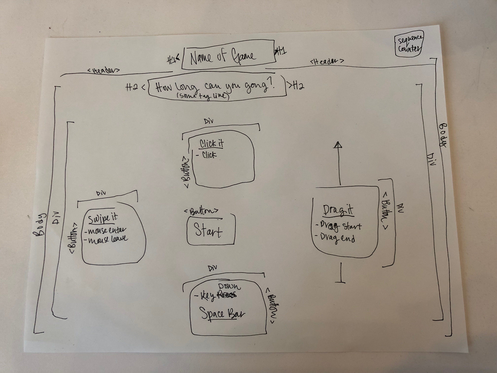

Overview
======
It's Simon! 

Technology Used
======

* Languages - HTML, CSS, Javascript
* Design - Google Fonts, Adobe Illustrator
* Sound - [ZapSplat](https://www.zapsplat.com/)
* Project Board - [Trello](https://trello.com/b/96gKOjdG/project-one-ga)
* Text Editor - VS Code

Wireframe
======

